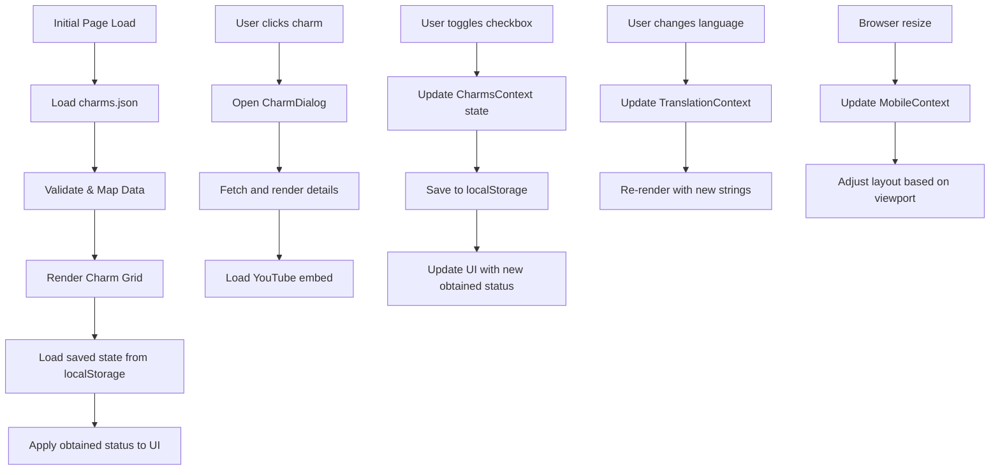

# AI-CONTEXT: HOLLOW-KNIGHT-FRIENDLY-CHARM-GUIDE

## METADATA
```json
{
  "project": "hollow-knight-friendly-charm-guide",
  "framework": "next.js",
  "version": "15.5.5",
  "styling": "tailwindcss",
  "language": "typescript",
  "state_management": "react_context",
  "storage": "localStorage",
  "ui_components": ["radix_ui", "custom_components"],
  "animations": "framer_motion",
  "last_updated": "2024-09-12"
}
```

## ARCHITECTURE
```yaml
project_structure:
  src:
    app:  # Next.js App Router
      page.tsx: "Main page with charm grid display"  
      layout.tsx: "Root layout with providers chain"
      globals.css: "Global styles including Tailwind directives"
    components:
      Charm.tsx: "Single charm component with image and hover effects"
      CharmDialog.tsx: "Modal wrapper for charm details, handles UI state"
      CharmDialogContent.tsx: "Content renderer for charm modal with YT embed"
      CollectedCheckbox.tsx: "Toggle component for obtained status"
      TopActions.tsx: "App bar with actions for clearing/filtering"
      ui/: "Low-level UI components built on Radix"
    data:
      charms.json: "Raw charm data with metadata and locations"
    lib:
      charmMapper.ts: "Type validation and transformation for charm data"
      CharmsContext.tsx: "State management for tracking obtained charms"
      localStorage.ts: "Persistence service for user preferences"
      MobileContext.tsx: "Responsive design context for layout switching"
      TranslationProvider.tsx: "i18n functionality and string management"
    locales: "Translation string files by language"
```

## DATA_STRUCTURES
```typescript
// DOMAIN_MODELS
type Charm = {
    id: string;        // Unique identifier for the charm
    description: string; // Localization key for description text
    location: string;    // Localization key for location text
    name: string;      // Localization key for charm name
    notches: number;   // Cost in notch slots (1-3)
    sprite: string;    // Image filename without extension
    video_url: string; // YouTube URL for location/guide
};

// CONTEXT_INTERFACES
interface ObtainedCharmsContextType {
    obtainedCharms: string[];  // Array of charm IDs marked as collected
    isCharmObtained: (charmId: string) => boolean; // Check if specific charm is collected
    toggleCharm: (charmId: string) => void;       // Toggle collected status
    clearAllCharms: () => void;                  // Reset all collection status
}

interface MobileContextType {
    isMobile: boolean;  // Current viewport state
}

interface TranslationContextType {
    t: (key: string) => string;  // Translation function
    locale: string;             // Current language
    setLocale: (locale: string) => void; // Change language
}

// PERSISTENCE
interface StorageService {
    getObtainedCharms(): string[];
    saveObtainedCharms(charmIds: string[]): void;
    clearObtainedCharms(): void;
}
```

## PATTERNS
```yaml
patterns:
  state_management:
    pattern: "Context-based state management with Provider/Consumer pattern"  
    implementation:
      - "React Context API for global state containers"  
      - "Providers chain in root layout.tsx for app-wide state access"  
      - "Custom hooks (useObtainedCharms, useTranslation, useMobile) for context consumption"  
      - "useState + useEffect for local component state"  
    examples: ["CharmsContext.tsx", "MobileContext.tsx", "TranslationProvider.tsx"]

  data_validation:
    pattern: "TypeScript type guards and validation"  
    implementation:
      - "Type predicate functions for runtime validation (charmsMapper)"  
      - "Interface-based props typing for all components"  
      - "Defensive coding patterns in localStorage operations with fallbacks"  
      - "Try/catch blocks for external API interactions"  
    examples: ["charmMapper.ts", "localStorage.ts"]

  component_composition:
    pattern: "Atomic design with component composition"  
    implementation:
      - "Small, focused components with single responsibilities"  
      - "Dialog/modal pattern using Radix UI for detailed views"  
      - "Container/presentation separation with prop drilling"  
      - "Fragment usage for avoiding unnecessary DOM nodes"  
    examples: ["CharmDialog.tsx", "CharmDialogContent.tsx"]

  persistence:
    pattern: "Browser storage with SSR compatibility"  
    implementation:
      - "localStorage with typeof window guards for SSR compatibility"  
      - "useEffect hooks for syncing React state with browser storage"  
      - "JSON serialization/deserialization for complex state"  
      - "Error handling for storage quota/permission issues"  
    examples: ["localStorage.ts", "CharmsContext.tsx"]

  responsive_design:
    pattern: "Context-driven responsive layouts"  
    implementation:
      - "MobileContext provider for viewport-aware components"  
      - "Conditional rendering based on viewport size"  
      - "CSS Grid with responsive column counts"  
      - "Tailwind breakpoint classes for responsive styling"  
    examples: ["MobileContext.tsx", "CharmDialogContent.tsx"]  
```

## CONVENTIONS
```yaml
code_conventions:
  naming:
    components: "PascalCase (Charm.tsx, CharmDialog.tsx)"  
    hooks: "camelCase with 'use' prefix (useObtainedCharms)"  
    utils: "camelCase (charmsMapper, getYouTubeEmbedUrl)"  
    interfaces: "PascalCase with 'Type' suffix or 'I' prefix"  
    context: "PascalCase with 'Context' suffix (ObtainedCharmsContext)"  

  component_structure:
    pattern: "Functional components with explicit TypeScript typing"  
    exports: "Named exports for components except pages"  
    client_directive: "'use client' at top of client components"  
    props_pattern: "Interface-based props with destructuring"  

  state_management:
    local_state: "useState with explicit typing"  
    updates: "Functional updates (prev => new) for derived state"  
    side_effects: "useEffect with explicit dependency arrays"  
    memoization: "useMemo/useCallback for expensive operations"  

  error_handling:
    browser_apis: "Try/catch blocks with console.error"  
    fallbacks: "Default values or empty arrays/objects"  
    type_guards: "Runtime type checking with fallbacks"  

  i18n_approach:
    keys: "Direct string keys in components (t('key_name'))"  
    interpolation: "HTML allowed in translation strings"  
    context: "TranslationProvider for global access"  
```

## STATE_FLOW


## KEY_USER_FLOWS
1. **Initial Load**: Next.js renders page → Initialize contexts → Load charms → Check localStorage → Apply saved state → Render optimized grid
2. **Charm Details**: Click charm → Modal opens → Load details → Fetch YouTube embed → Show location/description
3. **Mark Obtained**: Toggle checkbox → Update context → Save to localStorage → Apply visual change (opacity)
4. **Clear Progress**: Click clear button → Confirm action → Clear context → Remove from localStorage → Reset UI
5. **Responsive Adaptation**: Browser resize → Update context → Change layout → Optimize for current viewport

## TECHNICAL_IMPLEMENTATION
```yaml
optimizations:
  rendering:
    client_components: "'use client' directive for interactive components"  
    server_components: "Default server components for static content"  
    image_optimization: "Next.js Image component with width/height/priority"  
    conditional_rendering: "Early returns and ternary operators for conditional UI"  
    fragment_usage: "React.Fragment to avoid unnecessary DOM nodes"  
    memo: "Memoization for expensive computations and rerenders"  

  performance:
    youtube_optimization: "Embed URL parsing for efficient video loading"  
    iframe_lazy_loading: "Loading state for iframes to improve UX"  
    asset_optimization: "Static image assets with appropriate dimensions"  
    localStorage_batching: "Batched storage updates to minimize writes"  

  seo_accessibility:
    image_alt_texts: "Translated alt texts for all images"  
    semantic_html: "Appropriate heading levels and sectioning"  
    color_contrast: "High contrast UI for readability"  
    keyboard_navigation: "Focus management in dialogs"  

  build_optimization:
    next_config: "Minimal Next.js configuration for fast builds"  
    typescript: "Strict mode enabled for type safety"  
    tailwind: "JIT mode for optimized CSS generation"  
    module_structure: "Flat import structure to avoid circular dependencies"  
```

## STYLING_SYSTEM
```yaml
styling:
  primary_approach: "TailwindCSS utility-first methodology"
  
  class_structure:
    layout: "flex, grid, container classes for structure"
    spacing: "p-4, m-2, gap-3 style padding/margin/gap"
    responsive: "sm:, md:, lg: prefixes for breakpoints"
    states: "hover:, focus:, active: for interactive states"
  
  custom_styling:
    global_css: "globals.css for base styles and Tailwind directives"
    css_variables: "--font-crimson, --font-cinzel for typography"
    animations: "Tailwind + framer-motion for complex animations"
  
  theme:
    colors:
      primary: "Black backgrounds with light text for contrast"
      accents: "Gold/amber highlights for Hollow Knight theme"
    typography:
      heading_font: "Cinzel (variable font) for headings"
      body_font: "Crimson Text for body content"
      fallbacks: "Serif fallback chain"
    custom_components:
      charm_halo: "Custom glow effect for charm icons"
      dialog_styling: "Themed modal design consistent with game"
      notch_cost: "Visual indicator of charm notch cost"
  
  responsive_strategy:
    mobile_first: "Base styles for mobile, then scale up"
    breakpoints: "sm:640px, md:768px, lg:1024px, xl:1280px"
    layout_shifts: "Column-to-row transitions at breakpoints"
    font_scaling: "Responsive typography with text-sm through text-2xl"
```

## EXTENSION_POINTS
```yaml
extension_opportunities:
  data:
    new_charms: "Add entries to charms.json with required fields"
    charm_metadata: "Extend Charm type with additional properties"
    localization: "Add new language files in locales directory"
    categories: "Implement charm categories/filtering"

  features:
    build_planner: "Add charm build planning functionality"
    notch_calculator: "Calculate total notch cost of selected charms"
    synergy_detection: "Flag charm combinations with special effects"
    progress_tracking: "Implement game progression tracking"
    boss_strategies: "Add boss-specific charm recommendations"

  components:
    dialog_reuse: "CharmDialog pattern for other entity details"
    filter_system: "Implement filtering by charm properties"
    sorting_options: "Add various sort methods for charms"
    search_functionality: "Implement charm search by name/effect"

  architecture:
    state_management: "Extend context system for new state domains"
    data_persistence: "Add more sophisticated storage options"
    api_integration: "Implement backend API for user profiles"
    auth_system: "Add authentication for saving builds online"
```

## EDGE_CASES_AND_SOLUTIONS
```yaml
edge_cases:
  storage:
    issue: "localStorage access denied or unavailable"
    solution: "Try/catch blocks with graceful fallbacks to default state"
    location: "localStorage.ts:15-26"
  
  ssr_compatibility:
    issue: "Window undefined during SSR rendering"
    solution: "typeof window checks before accessing browser APIs"
    location: "Multiple files including localStorage.ts"
  
  translations:
    issue: "Missing translation keys"
    solution: "Fallback to key name instead of showing error"
    location: "TranslationProvider.tsx:42-45"
  
  responsive_breakpoints:
    issue: "Content layout issues at specific viewport sizes"
    solution: "Mobile context with adaptive layouts and media queries"
    location: "MobileContext.tsx, CharmDialogContent.tsx"
  
  youtube_embeds:
    issue: "Slow loading or failed embeds"
    solution: "Loading state and error fallback for iframes"
    location: "CharmDialogContent.tsx:45-55"
  
  touch_interactions:
    issue: "Different interaction models on touch devices"
    solution: "Larger tap targets and modified hover behaviors"
    location: "Charm.tsx, various components"
```

## PERFORMANCE_CONSIDERATIONS
```yaml
performance_optimizations:
  state_management:
    principle: "Minimal context state with specific selectors"
    implementation: "Custom hooks expose only needed data/methods"
    benefit: "Prevents unnecessary re-renders across component tree"
  
  code_splitting:
    principle: "Lazy loading for modal content"
    implementation: "Dialog content only rendered when opened"
    benefit: "Reduces initial bundle size and load time"
  
  image_optimization:
    principle: "Next.js Image component with proper dimensions"
    implementation: "width/height/priority attributes set appropriately"
    benefit: "Prevents layout shifts and optimizes image loading"
  
  memoization:
    principle: "useCallback/useMemo for expensive operations"
    implementation: "Applied to event handlers and derived data"
    benefit: "Prevents recalculation on each render"
  
  render_optimization:
    principle: "Conditional rendering to minimize DOM operations"
    implementation: "Early returns and ternary operators"
    benefit: "Reduces unnecessary DOM manipulation"
```

## AGENT_GUIDANCE
```yaml
ai_agent_hints:
  code_generation:
    follow_patterns: "Use existing patterns from similar components"
    naming_convention: "Match file/component naming conventions"
    typing: "Always include explicit TypeScript typing"
    hooks: "Follow existing hook patterns for new functionality"
  
  recommendations:
    prefer: ["TypeScript", "React hooks", "Context API", "Tailwind utilities"]
    avoid: ["Class components", "Redux", "Inline styles", "DOM manipulation"]
  
  development_approach:
    component_creation: "Start with types → props → rendering logic → interactions"
    state_management: "Consider local state first, then elevate as needed"
    styling: "Use existing Tailwind patterns before custom CSS"
    testing: "Consider component isolation and clear responsibilities"
  
  common_tasks:
    new_component: "Follow CharmDialog pattern for new entity displays"
    new_feature: "Implement with Context pattern if globally needed"
    ui_changes: "Maintain responsive behavior with existing breakpoint system"
    data_handling: "Follow charmMapper pattern for type validation"
```
