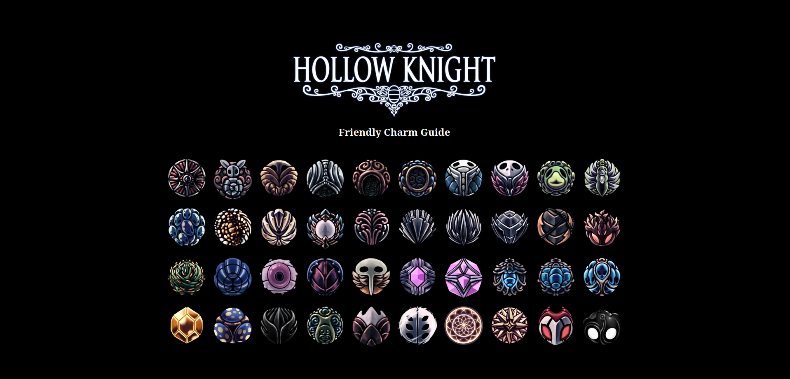

# Hollow Knight Friendly Charm Guide

A multi-language guide for Hollow Knight charms, designed to help players easily find every charm and reach the coveted 112%.

[](https://hollow-knight-friendly-charm-guide.vercel.app/)

## Live App

You can try the app online here:  
[https://hollow-knight-friendly-charm-guide.vercel.app/](https://hollow-knight-friendly-charm-guide.vercel.app/)

## Features

-   User-friendly interface: charms are arranged exactly as in the game inventory.
-   Detailed charm info: name, where and how to get it, effect, notches cost.
-   Multi-language support (see below for available languages).

## Multi-language support

The app launches on your browser language if supported. If not, the default language is English.

A specific language can be forced by setting the `lang` query parameter in the URL.

For example, to view the app in Spanish, open:

```
http://localhost:3000?lang=es
```

Supported languages:

-   Chinese – `zh`
-   English – `en`
-   French – `fr`
-   German – `de`
-   Italian – `it`
-   Japanese – `ja`
-   Korean – `ko`
-   Polish – `pl`
-   Portuguese – `pt`
-   Russian – `ru`
-   Spanish – `es`

This allows you to check translations without changing your browser language.

## For Devs ;)

To run the development server, use the following command:

```bash
npm run dev
```

Then open [http://localhost:3000](http://localhost:3000) in your browser.

### Project Structure

-   `/src/components` – React components for UI
-   `/src/locales` – Translation files for each language
-   `/src/data` – Static data (charms, etc.)
-   `/src/lib` – Utility functions and hooks

### Contributing

Feel free to submit issues or pull requests to improve translations, add features, or fix bugs.

### License

This project is open source and available under the MIT License.
